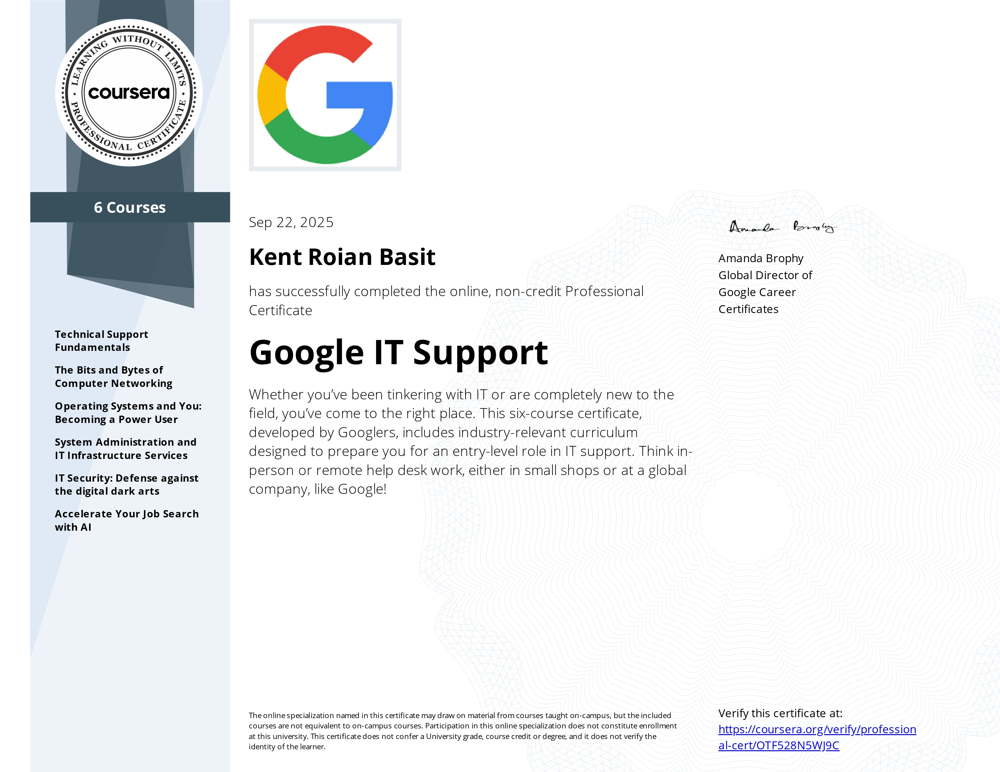

# Google IT Support Professional Certificate

# 📋 Overview
This repository documents my completion of the Google IT Support Professional Certificate, a comprehensive program covering fundamental IT support skills.

- **Issuer:** Google
- **Platform:** Coursera
- **Completion Date:** September, 2025
- **Credential ID:** 2a559464-01cf-4cf8-a9d7-8a23167250df
- **Verification URL:** https://www.credly.com/badges/2a559464-01cf-4cf8-a9d7-8a23167250df/public_url

### Technical Competencies
- **Operating Systems:** Windows 10, Linux (command line, file systems, user management)
- **Networking:** TCP/IP, DNS, DHCP, IPv4 vs. IPv6, wireless networks, network troubleshooting
- **System Administration:** User provisioning, data backup and recovery, directory services
- **Security:** Encryption, authentication, defense in depth, security hardening
- **IT Infrastructure:** Cloud computing, virtualization, system maintenance
  

# 📚 Course Breakdown
