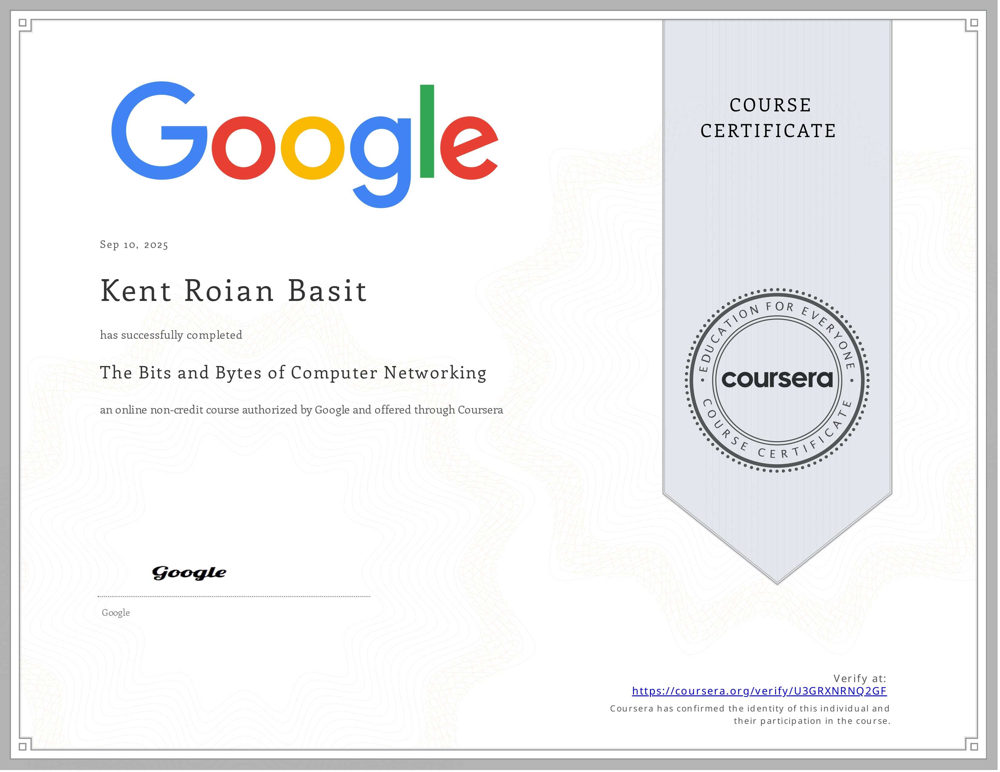

# 🔤 The Bits and Bytes of Computer Networking

## 📝 Summary
This in-depth course provided me with a comprehensive understanding of modern network infrastructure, building proficiency in core protocols like TCP/IP and DHCP, the OSI and TCP/IP models, and critical network services, while also covering essential topics in wireless networking, VPNs, and network security to ensure data integrity.

## 💡 Skills and Competencies Gained
| Module Focus | Key Skills & Knowledge Acquired |
|--------------|---------------------------------|
| Introduction to Networking | I built a solid foundation in network infrastructure by learning how data is framed and physically transmitted across networks. I gained practical knowledge of essential hardware and protocols, including the function of twisted-pair cabling, the difference between Layer 2 switches and hubs, and the role of routers. I mastered core concepts like the TCP/IP five-layer model, dissecting the structure of an Ethernet frame to understand MAC addressing. |
| The Network Layer | Tackled the core functions of the network layer, gaining a practical understanding of IPv4 addressing, including classful networks and the transition to Classless Inter-Domain Routing (CIDR). I developed the ability to perform subnetting calculations and configure subnet masks to efficiently partition network address space. I also explored the mechanics of IP datagram encapsulation, the role of the Address Resolution Protocol (ARP), and the principles of routing, including the function of routing tables and the distinction between interior and exterior gateway protocols. |