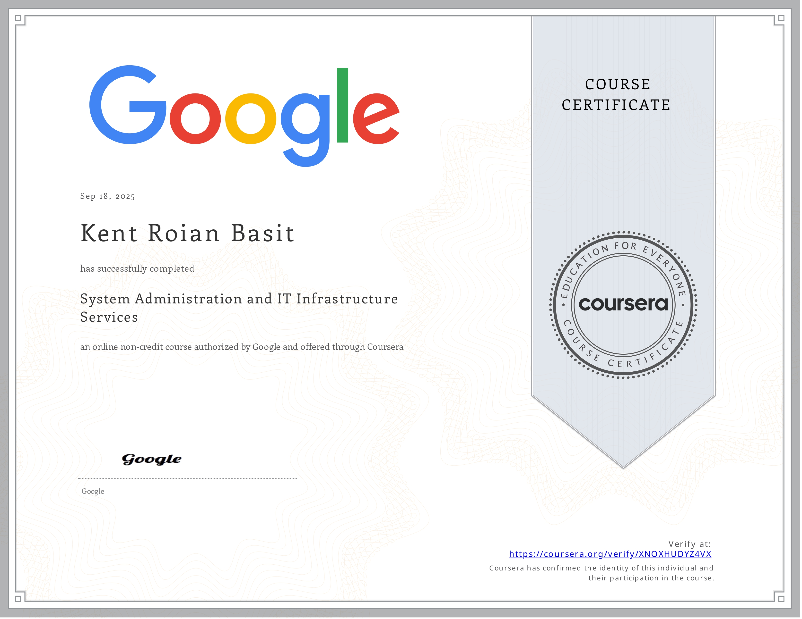

# 👥 System Administration and IT Infrastructure Services

## 📝 Summary
This course delivers a foundation in the core responsibilities of an IT professional. It equips in-demand skills for configuring and maintaining modern technology environments, covering essential areas from user and server administration using tools like Active Directory to implementing robust data storage and disaster recovery solutions.

## 💡 Skills and Competencies Gained
| Module Focus | Key Skills & Knowledge Acquired |
|--------------|---------------------------------|
| Network and Infrastructure Services | The comparative exercise of service management contrasting the centralized, service-oriented architecture of Windows with Linux's decentralized, process-driven `systemd` model sharpened my understanding of how operating systems orchestrate background daemons that form the backbone of IT infrastructure. Drilling into the configuration of fundamental protocols like DNS and DHCP, particularly through practical labs with tools like `dnsmasq`, deepened my appreciation for the critical role these services play in network discovery and resource allocation, while the deliberate practice of troubleshooting hostname resolution and service failures reaffirmed the systematic approach required to maintain a stable and functional network environment. |
| Software and Platform Services | Deploying and managing services contrasting the integrated role of web servers like IIS in the Windows ecosystem with the modular, config-file-driven approach of Apache on Linux sharpened my understanding of how application platforms translate code into accessible user services. Drilling into the protocols underpinning email, file sharing, and print services deepened my appreciation for the standardized communication layers that enable cross-platform productivity, while the deliberate practice of troubleshooting website availability and exploring cloud migration concepts reaffirmed the critical systems thinking required to support and evolve a modern service-oriented infrastructure. |
| Directory Services | I moved beyond simply creating user accounts to architecting the very systems that govern them, contrasting the all-encompassing, policy-driven domain of Microsoft's Active Directory with the more modular, standards-based approach of OpenLDAP. Configuring Group Policy Objects revealed the immense power of centralized management, where a single change could propagate across thousands of endpoints, while troubleshooting inheritance conflicts and replication issues drove home the critical balance between granular control and administrative complexity required to maintain a secure and stable directory environment. This wasn't just about users and groups; it was about constructing the authoritative source of truth for an entire organization's digital identity. |
| Data Recovery and Backups | The curriculum peeled back the layers of backup strategies, revealing the critical calculus between storage efficiency and restoration time inherent in full, incremental, and differential approaches. It cemented the sobering reality that a backup is merely a potential until a disciplined disaster recovery plan complete with ruthless testing protocols transforms it into a guaranteed lifeline. The practice of composing a post-mortem served as the final, crucial step, turning inevitable failures into institutional knowledge and ensuring that recovery is a repeatable, systematic art, not a panicked reaction. |